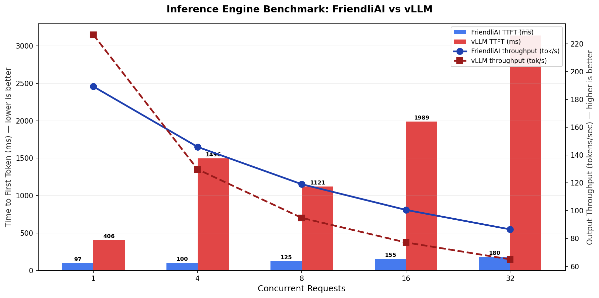

# Inference Engine Benchmark: FriendliAI vs vLLM

A reproducible benchmarking tool that compares inference performance between the FriendliAI Engine and vLLM (or any OpenAI-compatible inference server).

## Quick Start

### Prerequisites

```bash
pip install aiohttp matplotlib numpy
```

Both inference engines must be deployed and accessible via their OpenAI-compatible `/v1/chat/completions` endpoints before running.

### Configuration

Copy `.env_example` to `.env` and fill in your credentials:

```bash
cp .env_example .env
```

### Run

```bash
python benchmark.py \
    --friendli-url https://api.friendli.ai/dedicated/v1 \
    --friendli-key $FRIENDLI_TOKEN \
    --friendli-model $FRIENDLI_ENDPOINT_ID \
    --vllm-url https://api.runpod.ai/v2/$RUNPOD_ENDPOINT_ID/openai/v1 \
    --vllm-key $RUNPOD_API_KEY \
    --vllm-model qwen/qwen3-30b-a3b
```

For reasoning models like Qwen3, disable thinking tokens for fair comparison:

```bash
python benchmark.py \
    --friendli-url https://api.friendli.ai/dedicated/v1 \
    --friendli-key $FRIENDLI_TOKEN \
    --friendli-model $FRIENDLI_ENDPOINT_ID \
    --friendli-extra-body '{"chat_template_kwargs":{"enable_thinking":false}}' \
    --vllm-url https://api.runpod.ai/v2/$RUNPOD_ENDPOINT_ID/openai/v1 \
    --vllm-key $RUNPOD_API_KEY \
    --vllm-model qwen/qwen3-30b-a3b
```

The script automatically adds `/no_think` to the system prompt for vLLM compatibility.

### Optional Parameters

| Flag | Default | Description |
|------|---------|-------------|
| `--concurrency` | `1,4,8,16,32` | Concurrency levels to test |
| `--requests-per-level` | `16` | Total requests per concurrency level |
| `--max-tokens` | `256` | Max output tokens per request |
| `--output` | `benchmark_results.png` | Output chart filename |
| `--vllm-key` | *(empty)* | vLLM API key, if authentication is enabled |
| `--friendli-extra-body` | *(none)* | Extra JSON body for FriendliAI requests |

## Infrastructure

The sample results below were collected from the following setup:

| Component | FriendliAI | vLLM (RunPod) |
|-----------|-----------|---------------|
| **Engine** | FriendliAI Engine (proprietary) | vLLM v2.14.0 (open-source) |
| **Model** | Qwen/Qwen3-30B-A3B | Qwen/Qwen3-30B-A3B |
| **GPU** | NVIDIA H100 (1x) | NVIDIA H100 (1x, AU datacenter) |
| **Endpoint type** | Dedicated endpoint | Serverless (RunPod) |
| **API** | OpenAI-compatible (`/v1/chat/completions`) | OpenAI-compatible (`/v1/chat/completions`) |
| **Thinking tokens** | Disabled via `chat_template_kwargs` | Disabled via `/no_think` system prompt |
| **Benchmark client** | Kali Linux, residential ISP (US) | Same machine, same network |

### Latency Considerations

The TTFT measurements include network round-trip time between the benchmark client and each endpoint. In this setup, the FriendliAI and RunPod endpoints are in different datacenters (RunPod allocated GPU capacity in Australia). This means **absolute TTFT values include different network latency components**. FriendliAI's datacenter location is not disclosed but latency suggests US-based, which is closer to the benchmark client.

However, the benchmark remains meaningful for two reasons:

1. **Per-request throughput** (tokens/sec during the decode phase) is measured as the rate of token delivery *after* the first token arrives, so it is independent of network latency to the endpoint. This metric reflects pure engine decode efficiency.

2. **Aggregate throughput** measures total system capacity under load, which is also dominated by GPU compute, not network latency.

For a production evaluation with TTFT as a primary metric, both engines should be deployed in the same datacenter (or measured from a client colocated with each endpoint). The script supports this — simply point both `--friendli-url` and `--vllm-url` at endpoints in the same region.

## Sample Run

```
$ python benchmark.py \
    --friendli-url https://api.friendli.ai/dedicated/v1 \
    --friendli-key flp_... \
    --friendli-model deps004cnw2p0gw \
    --friendli-extra-body '{"chat_template_kwargs":{"enable_thinking":false}}' \
    --vllm-url https://api.runpod.ai/v2/kflzr1tngpywxm/openai/v1 \
    --vllm-key rpa_... \
    --vllm-model qwen/qwen3-30b-a3b

Warming up engines...
  FriendliAI: OK
  vLLM: OK

============================================================
  Benchmarking: FriendliAI Engine
  Endpoint:     https://api.friendli.ai/dedicated/v1
  Model:        deps004cnw2p0gw
============================================================
  Concurrency   1: sending 32 requests... done (32 ok, 0 err) | TTFT p50=0.097s | throughput=189.3 tok/s
  Concurrency   4: sending 32 requests... done (32 ok, 0 err) | TTFT p50=0.100s | throughput=145.9 tok/s
  Concurrency   8: sending 32 requests... done (32 ok, 0 err) | TTFT p50=0.125s | throughput=119.0 tok/s
  Concurrency  16: sending 32 requests... done (32 ok, 0 err) | TTFT p50=0.155s | throughput=100.6 tok/s
  Concurrency  32: sending 32 requests... done (32 ok, 0 err) | TTFT p50=0.180s | throughput=86.6 tok/s

============================================================
  Benchmarking: vLLM
  Endpoint:     https://api.runpod.ai/v2/kflzr1tngpywxm/openai/v1
  Model:        qwen/qwen3-30b-a3b
============================================================
  Concurrency   1: sending 32 requests... done (32 ok, 0 err) | TTFT p50=0.406s | throughput=226.5 tok/s
  Concurrency   4: sending 32 requests... done (32 ok, 0 err) | TTFT p50=1.496s | throughput=129.8 tok/s
  Concurrency   8: sending 32 requests... done (32 ok, 0 err) | TTFT p50=1.121s | throughput=94.8 tok/s
  Concurrency  16: sending 32 requests... done (32 ok, 0 err) | TTFT p50=1.989s | throughput=77.2 tok/s
  Concurrency  32: sending 32 requests... done (32 ok, 0 err) | TTFT p50=3.139s | throughput=65.0 tok/s

Chart saved to benchmark_results.png
```

### Output Chart



### Key Observations

- **TTFT**: FriendliAI maintains 97-180ms (p50) across all concurrency levels, while vLLM degrades from 406ms to 3,139ms as load increases. Even accounting for network latency differences (AU datacenter for RunPod), FriendliAI's TTFT remains remarkably stable under pressure.
- **Per-request throughput**: Both engines start around 190-227 tok/s at concurrency=1. Under load, FriendliAI degrades more gracefully — 87 tok/s at concurrency=32 vs vLLM's 65 tok/s (33% higher throughput under peak load).
- **GPU parity**: Both engines run on NVIDIA H100, eliminating GPU as a variable.
- **Data volume**: 32 requests per concurrency level (160 total requests per engine) for statistical robustness.

## Metrics

**Time to First Token (TTFT)** — Time from sending the request to receiving the first generated token. Reported as median (p50) and p90. TTFT reflects prefill efficiency and is critical for interactive and agentic use cases where latency compounds across turns.

**Per-Request Output Throughput (tokens/sec)** — Output tokens divided by decode time (first token to last token) for each request. This measures how fast a single user sees tokens stream in — the direct user experience metric.

**Aggregate Throughput (total tokens/sec)** — Total output tokens across all concurrent requests divided by total decode wall-clock time. This measures system capacity under load — the metric that drives cost-per-token at scale.

## Why These Metrics

- **TTFT** answers: "How responsive is the engine?"
- **Per-request throughput** answers: "How fast does a single user get their response?"
- **Aggregate throughput** answers: "How efficiently does the engine use hardware under load?"

## Why This Visualization

A single dual-axis chart overlays both key metrics — TTFT (bars, left axis) and per-request throughput (lines, right axis) — across concurrency levels. This immediately reveals the performance gap: FriendliAI's TTFT bars remain flat while vLLM's grow dramatically, and the throughput lines show FriendliAI maintaining higher output rates under load. One chart, one conclusion.

## Fairness Controls

- **Same model**: Both engines serve Qwen/Qwen3-30B-A3B.
- **Same prompts**: Identical prompt set in identical order.
- **Same parameters**: `max_tokens`, system prompt, and thinking disabled on both sides.
- **Warm-up**: One request sent to each engine before measurement to avoid cold-start bias.
- **Streaming**: Both engines measured via streaming SSE.
- **Same GPU**: Both engines run on NVIDIA H100.
- **Caveats**: Different datacenter locations (RunPod allocated AU region) affect TTFT due to network latency. A production evaluation should colocate both endpoints or measure from a client near each.
